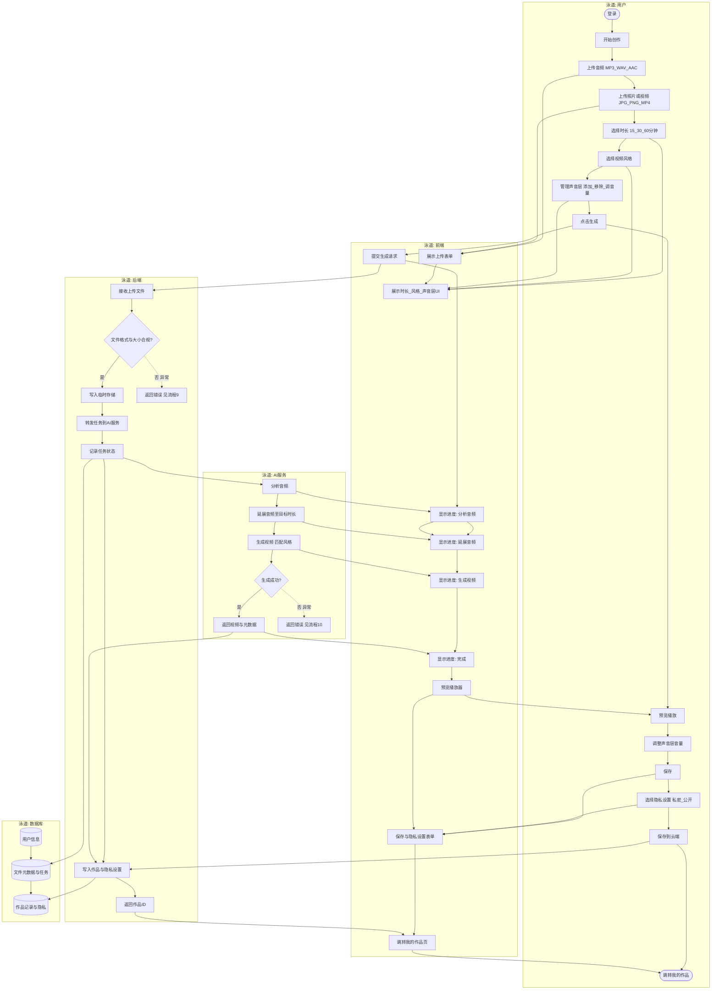

# 流程1：ASMR 创作完整流程（最详细）

泳道：用户 | 前端 | 后端 | AI服务 | 数据库

## 图例
- 圆角矩形：开始/结束
- 矩形：用户操作或系统处理
- 菱形：判断点
- 圆柱：数据存储
- 虚线箭头：异常路径（见流程9、流程10）

## 用户输入点
- 上传音频、上传照片/视频、选择时长、选择视频风格、管理声音层、点击生成、调整音量、保存、选择隐私设置

## 系统判断点
- 文件格式与大小是否合规、生成是否成功
