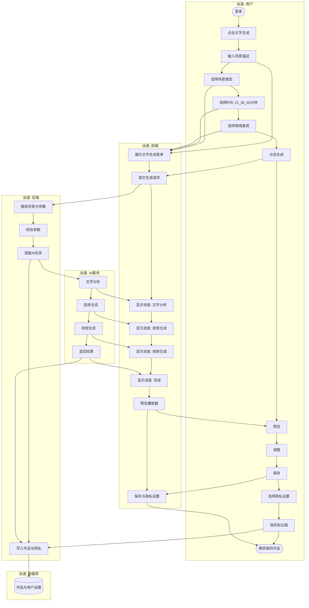

# 流程2：AI 文字生成 ASMR 流程

泳道：用户 | 前端 | 后端 | AI服务 | 数据库

```mermaid
flowchart TB
  subgraph user["泳道: 用户"]
    U1([登录])
    U2[点击文字生成]
    U3[输入场景描述]
    U4[选择场景类型]
    U5[选择时长 15_30_60分钟]
    U6[选择情绪基调]
    U7[点击生成]
    U8[预览]
    U9[调整]
    U10[保存]
    U11[选择隐私设置]
    U12[保存到云端]
    U13([跳转我的作品])
    U1 --> U2 --> U3 --> U4 --> U5 --> U6 --> U7
    U7 --> U8 --> U9 --> U10 --> U11 --> U12 --> U13
  end

  subgraph fe["泳道: 前端"]
    F1[展示文字生成表单]
    F2[提交生成请求]
    F3[显示进度: 文字分析]
    F4[显示进度: 音频生成]
    F5[显示进度: 视频生成]
    F6[显示进度: 完成]
    F7[预览播放器]
    F8[保存与隐私设置]
    F1 --> F2 --> F3 --> F4 --> F5 --> F6 --> F7 --> F8
  end

  subgraph be["泳道: 后端"]
    B1[接收场景与参数]
    B2[校验参数]
    B3[调度AI任务]
    B4[写入作品与隐私]
    B1 --> B2 --> B3 --> B4
  end

  subgraph ai["泳道: AI服务"]
    A1[文字分析]
    A2[音频生成]
    A3[视频生成]
    A4[返回结果]
    A1 --> A2 --> A3 --> A4
  end

  subgraph db["泳道: 数据库"]
    D1[(作品与用户设置)]
  end

  U3 --> F1
  U4 --> F1
  U5 --> F1
  U6 --> F1
  U7 --> F2
  F2 --> B1
  B3 --> A1
  A4 --> B4
  B4 --> D1
  A1 --> F3
  A2 --> F4
  A3 --> F5
  A4 --> F6
  F7 --> U8
  U10 --> F8
  U12 --> B4
  F8 --> U13
```

## 用户输入点
- 场景描述、场景类型、时长、情绪基调、点击生成、调整、保存、隐私设置

## 进度节点
- 文字分析 → 音频生成 → 视频生成 → 完成
