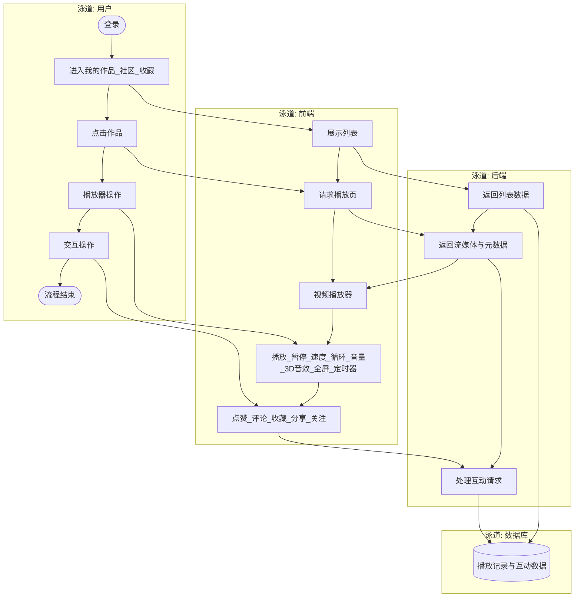

# 流程3：观看 ASMR 作品流程

泳道：用户 | 前端 | 后端 | AI服务 | 数据库

```mermaid
flowchart TB
  subgraph user["泳道: 用户"]
    U1([登录])
    U2[进入我的作品_社区_收藏]
    U3[点击作品]
    U4[播放器操作]
    U5[交互操作]
    U6([流程结束])
    U1 --> U2 --> U3 --> U4 --> U5 --> U6
  end

  subgraph fe["泳道: 前端"]
    F1[展示列表]
    F2[请求播放页]
    F3[视频播放器]
    F4[播放_暂停_速度_循环_音量_3D音效_全屏_定时器]
    F5[点赞_评论_收藏_分享_关注]
    F1 --> F2 --> F3
    F3 --> F4 --> F5
  end

  subgraph be["泳道: 后端"]
    B1[返回列表数据]
    B2[返回流媒体与元数据]
    B3[处理互动请求]
    B1 --> B2 --> B3
  end

  subgraph db["泳道: 数据库"]
    D1[(播放记录与互动数据)]
  end

  U2 --> F1
  F1 --> B1
  B1 --> D1
  U3 --> F2
  F2 --> B2
  B2 --> F3
  U4 --> F4
  U5 --> F5
  F5 --> B3
  B3 --> D1
```

## 用户操作
- 播放/暂停、调整速度、循环、音量、3D 音效、全屏、定时器；点赞、评论、收藏、分享、关注
