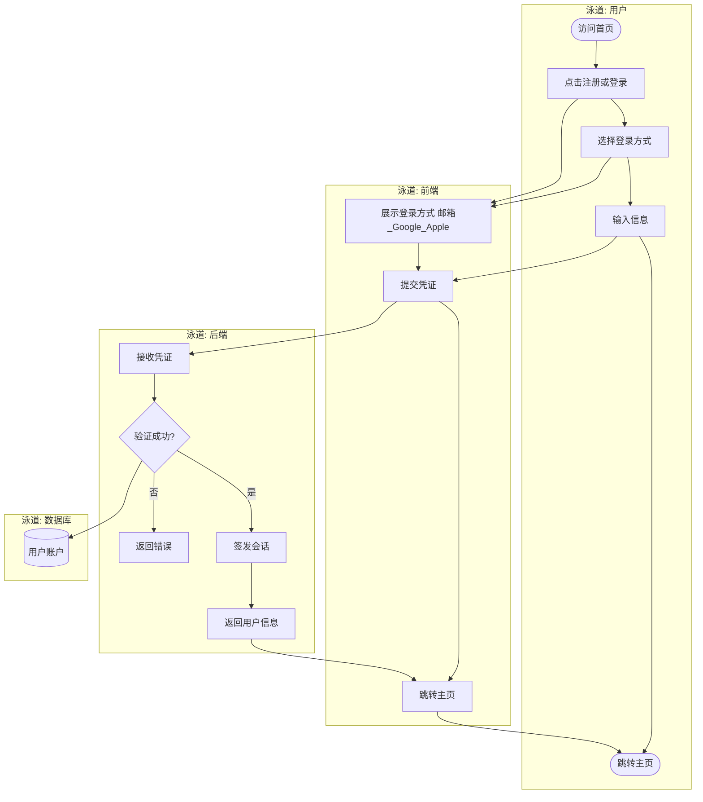

# 流程4：用户注册登录流程

泳道：用户 | 前端 | 后端 | 数据库

```mermaid
flowchart TB
  subgraph user["泳道: 用户"]
    U1([访问首页])
    U2[点击注册或登录]
    U3[选择登录方式]
    U4[输入信息]
    U5([跳转主页])
    U1 --> U2 --> U3 --> U4 --> U5
  end

  subgraph fe["泳道: 前端"]
    F1[展示登录方式 邮箱_Google_Apple]
    F2[提交凭证]
    F3[跳转主页]
    F1 --> F2 --> F3
  end

  subgraph be["泳道: 后端"]
    B1[接收凭证]
    B2{验证成功?}
    B3[签发会话]
    B4[返回用户信息]
    B1 --> B2
    B2 -->|是| B3 --> B4
    B2 -->|否| B2N[返回错误]
  end

  subgraph db["泳道: 数据库"]
    D1[(用户账户)]
  end

  U2 --> F1
  U3 --> F1
  U4 --> F2
  F2 --> B1
  B2 --> D1
  B4 --> F3
  F3 --> U5
```

## 登录方式
- 邮箱、Google、Apple
