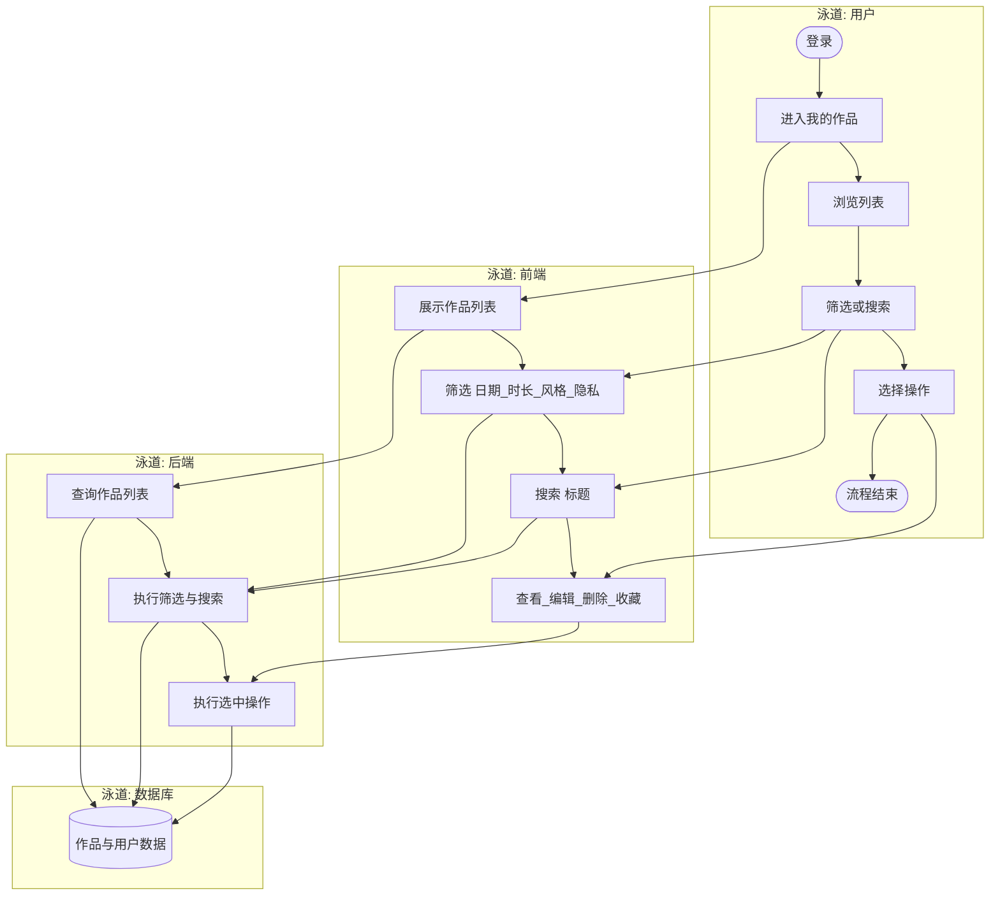

# 流程5：作品管理流程

泳道：用户 | 前端 | 后端 | 数据库

```mermaid
flowchart TB
  subgraph user["泳道: 用户"]
    U1([登录])
    U2[进入我的作品]
    U3[浏览列表]
    U4[筛选或搜索]
    U5[选择操作]
    U6([流程结束])
    U1 --> U2 --> U3 --> U4 --> U5 --> U6
  end

  subgraph fe["泳道: 前端"]
    F1[展示作品列表]
    F2[筛选 日期_时长_风格_隐私]
    F3[搜索 标题]
    F4[查看_编辑_删除_收藏]
    F1 --> F2 --> F3 --> F4
  end

  subgraph be["泳道: 后端"]
    B1[查询作品列表]
    B2[执行筛选与搜索]
    B3[执行选中操作]
    B1 --> B2 --> B3
  end

  subgraph db["泳道: 数据库"]
    D1[(作品与用户数据)]
  end

  U2 --> F1
  F1 --> B1
  B1 --> D1
  U4 --> F2
  U4 --> F3
  F2 --> B2
  F3 --> B2
  B2 --> D1
  U5 --> F4
  F4 --> B3
  B3 --> D1
```

## 筛选与操作
- 筛选：日期、时长、风格、隐私
- 搜索：标题
- 操作：查看、编辑、删除、收藏
