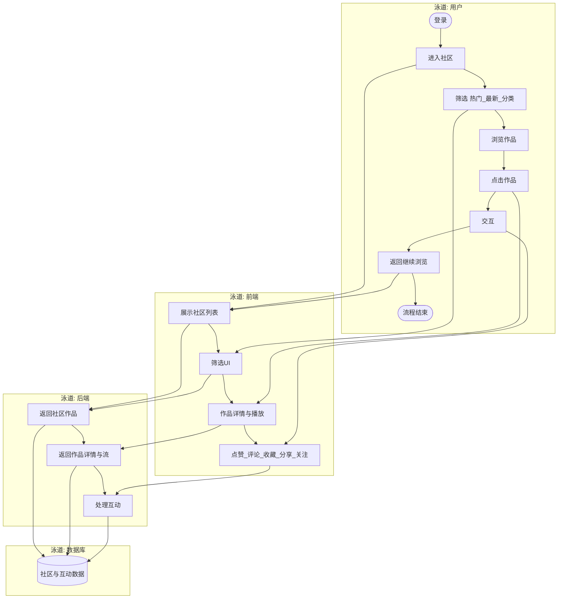

# 流程6：社区浏览流程

泳道：用户 | 前端 | 后端 | 数据库

```mermaid
flowchart TB
  subgraph user["泳道: 用户"]
    U1([登录])
    U2[进入社区]
    U3[筛选 热门_最新_分类]
    U4[浏览作品]
    U5[点击作品]
    U6[交互]
    U7[返回继续浏览]
    U8([流程结束])
    U1 --> U2 --> U3 --> U4 --> U5 --> U6 --> U7 --> U8
  end

  subgraph fe["泳道: 前端"]
    F1[展示社区列表]
    F2[筛选UI]
    F3[作品详情与播放]
    F4[点赞_评论_收藏_分享_关注]
    F1 --> F2 --> F3 --> F4
  end

  subgraph be["泳道: 后端"]
    B1[返回社区作品]
    B2[返回作品详情与流]
    B3[处理互动]
    B1 --> B2 --> B3
  end

  subgraph db["泳道: 数据库"]
    D1[(社区与互动数据)]
  end

  U2 --> F1
  F1 --> B1
  B1 --> D1
  U3 --> F2
  F2 --> B1
  U5 --> F3
  F3 --> B2
  B2 --> D1
  U6 --> F4
  F4 --> B3
  B3 --> D1
  U7 --> F1
```

## 交互
- 点赞、评论、收藏、分享、关注
