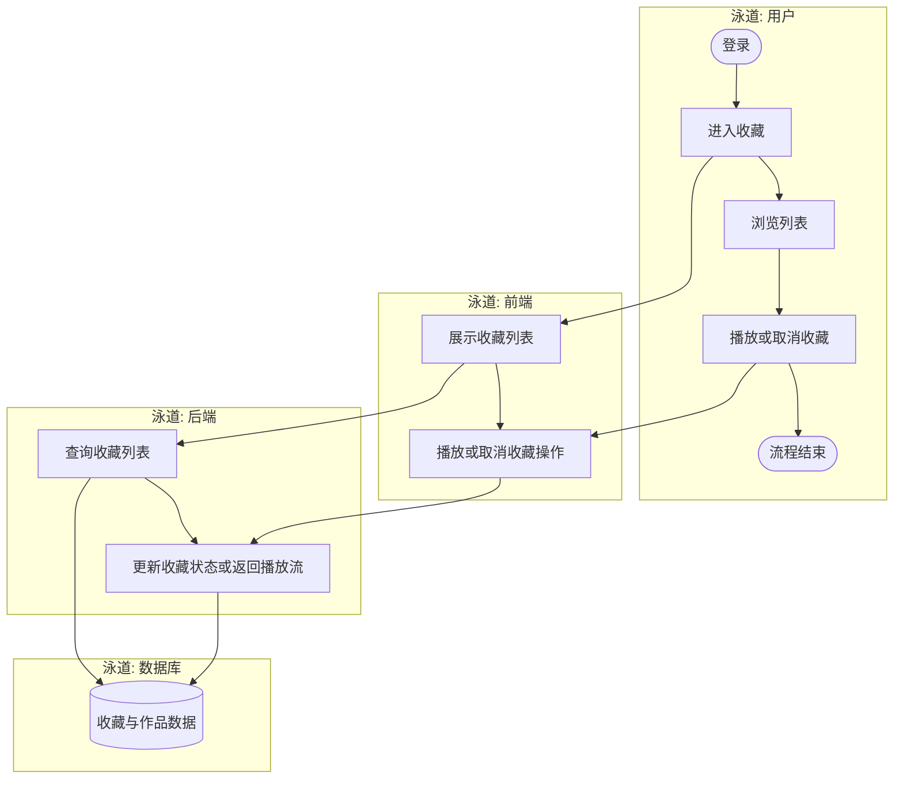

# 流程7：收藏管理流程

泳道：用户 | 前端 | 后端 | 数据库

```mermaid
flowchart TB
  subgraph user["泳道: 用户"]
    U1([登录])
    U2[进入收藏]
    U3[浏览列表]
    U4[播放或取消收藏]
    U5([流程结束])
    U1 --> U2 --> U3 --> U4 --> U5
  end

  subgraph fe["泳道: 前端"]
    F1[展示收藏列表]
    F2[播放或取消收藏操作]
    F1 --> F2
  end

  subgraph be["泳道: 后端"]
    B1[查询收藏列表]
    B2[更新收藏状态或返回播放流]
    B1 --> B2
  end

  subgraph db["泳道: 数据库"]
    D1[(收藏与作品数据)]
  end

  U2 --> F1
  F1 --> B1
  B1 --> D1
  U4 --> F2
  F2 --> B2
  B2 --> D1
```
