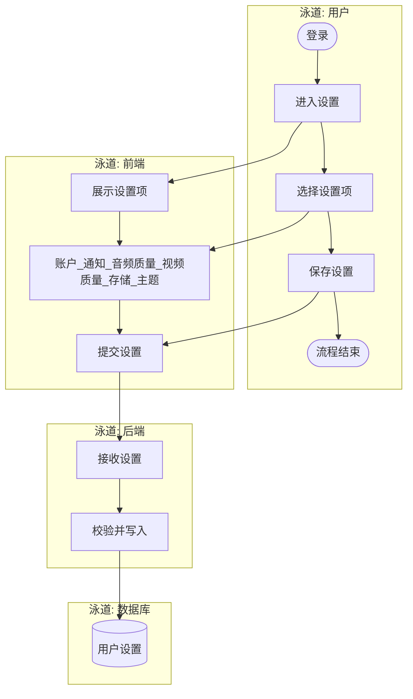

# 流程8：用户设置流程

泳道：用户 | 前端 | 后端 | 数据库

```mermaid
flowchart TB
  subgraph user["泳道: 用户"]
    U1([登录])
    U2[进入设置]
    U3[选择设置项]
    U4[保存设置]
    U5([流程结束])
    U1 --> U2 --> U3 --> U4 --> U5
  end

  subgraph fe["泳道: 前端"]
    F1[展示设置项]
    F2[账户_通知_音频质量_视频质量_存储_主题]
    F3[提交设置]
    F1 --> F2 --> F3
  end

  subgraph be["泳道: 后端"]
    B1[接收设置]
    B2[校验并写入]
    B1 --> B2
  end

  subgraph db["泳道: 数据库"]
    D1[(用户设置)]
  end

  U2 --> F1
  U3 --> F2
  U4 --> F3
  F3 --> B1
  B2 --> D1
```

## 设置项
- 账户、通知、音频质量、视频质量、存储、主题
