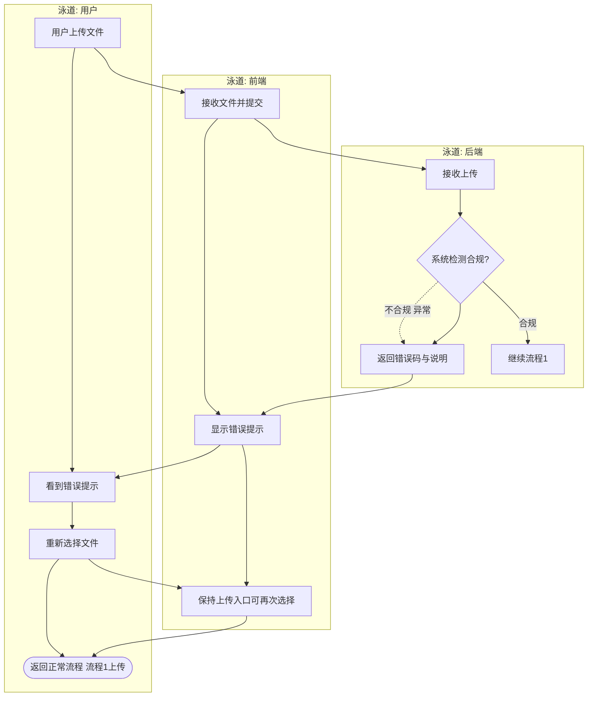

# 流程9：上传失败处理（异常流程）

泳道：用户 | 前端 | 后端 | 数据库

**衔接**：自流程1「上传音频/照片/视频」节点进入；处理后可返回流程1重新选择文件。

```mermaid
flowchart TB
  subgraph user["泳道: 用户"]
    U1[用户上传文件]
    U2[看到错误提示]
    U3[重新选择文件]
    U4([返回正常流程 流程1上传])
    U1 --> U2 --> U3 --> U4
  end

  subgraph fe["泳道: 前端"]
    F1[接收文件并提交]
    F2[显示错误提示]
    F3[保持上传入口可再次选择]
    F1 --> F2 --> F3
  end

  subgraph be["泳道: 后端"]
    B1[接收上传]
    B2{系统检测合规?}
    B3[返回错误码与说明]
    B1 --> B2
    B2 -.->|不合规 异常| B3
    B2 -->|合规| B2OK[继续流程1]
  end

  U1 --> F1
  F1 --> B1
  B2 --> B3
  B3 --> F2
  F2 --> U2
  U3 --> F3
  F3 --> U4
```

## 图例
- 虚线箭头：异常路径
- 不合规示例：格式不符、大小超限、类型不允许等
