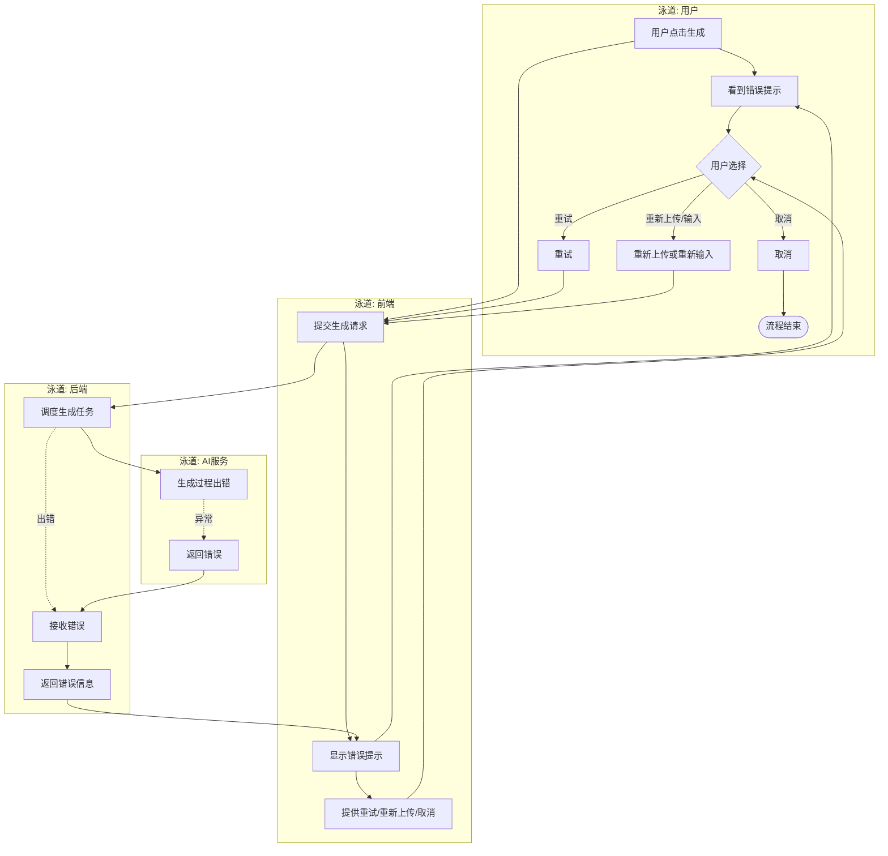

# 流程10：生成失败处理（异常流程）

泳道：用户 | 前端 | 后端 | AI服务 | 数据库

**衔接**：自流程1或流程2「点击生成」后，生成过程出错时进入。

```mermaid
flowchart TB
  subgraph user["泳道: 用户"]
    U1[用户点击生成]
    U2[看到错误提示]
    U3{用户选择}
    U4A[重试]
    U4B[重新上传或重新输入]
    U4C[取消]
    U5([流程结束])
    U1 --> U2 --> U3
    U3 -->|重试| U4A
    U3 -->|重新上传/输入| U4B
    U3 -->|取消| U4C --> U5
  end

  subgraph fe["泳道: 前端"]
    F1[提交生成请求]
    F2[显示错误提示]
    F3[提供重试/重新上传/取消]
    F1 --> F2 --> F3
  end

  subgraph be["泳道: 后端"]
    B1[调度生成任务]
    B2[接收错误]
    B3[返回错误信息]
    B1 -.->|出错| B2 --> B3
  end

  subgraph ai["泳道: AI服务"]
    A1[生成过程出错]
    A1 -.->|异常| A1OUT[返回错误]
  end

  U1 --> F1
  F1 --> B1
  B1 --> A1
  A1OUT --> B2
  B3 --> F2
  F2 --> U2
  F3 --> U3
  U4A --> F1
  U4B --> F1
```

## 图例
- 虚线箭头：异常路径
- 用户选项：重试、重新上传/重新输入、取消
