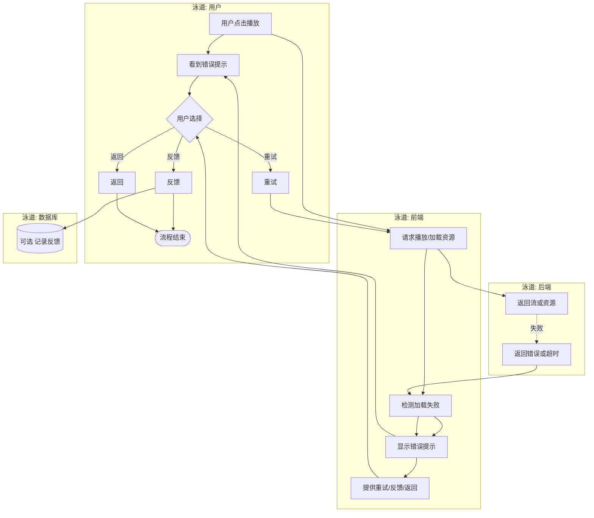

# 流程11：播放失败处理（异常流程）

泳道：用户 | 前端 | 后端 | 数据库

**衔接**：自流程3「点击作品播放」时，加载失败则进入本流程。

```mermaid
flowchart TB
  subgraph user["泳道: 用户"]
    U1[用户点击播放]
    U2[看到错误提示]
    U3{用户选择}
    U4A[重试]
    U4B[反馈]
    U4C[返回]
    U5([流程结束])
    U1 --> U2 --> U3
    U3 -->|重试| U4A
    U3 -->|反馈| U4B --> U5
    U3 -->|返回| U4C --> U5
  end

  subgraph fe["泳道: 前端"]
    F1[请求播放/加载资源]
    F2[检测加载失败]
    F3[显示错误提示]
    F4[提供重试/反馈/返回]
    F1 --> F2 --> F3 --> F4
  end

  subgraph be["泳道: 后端"]
    B1[返回流或资源]
    B2[返回错误或超时]
    B1 -.->|失败| B2
  end

  subgraph db["泳道: 数据库"]
    D1[(可选 记录反馈)]
  end

  U1 --> F1
  F1 --> B1
  B2 --> F2
  F2 --> F3
  F3 --> U2
  F4 --> U3
  U4A --> F1
  U4B --> D1
```

## 图例
- 虚线箭头：异常路径
- 用户选项：重试、反馈、返回
